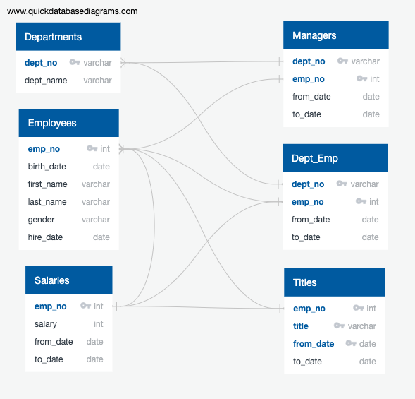
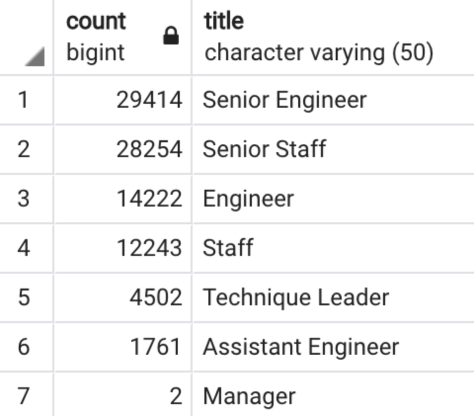
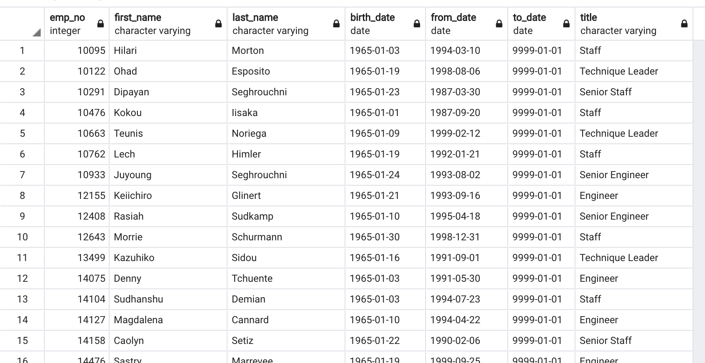
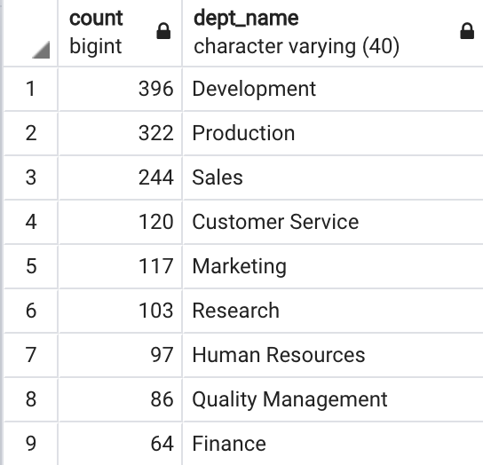

# Pewlett-Hackard-Analysis

## Purpose

The upper management of Pewlett-Hackard has asked us to prepare several lists of employees that will be retiring soon as well as soon-to-be retirees that could be good candidates for the mentorship program. 

## Resources 

- Data Source: departments.csv, employees.csv, titles.csv, salaries.csv, dept_emp.csv, dept_manager.csv
- Software: QuickDBD, PostgresSQL 11, pgAdmin 4.24

## Summary

ERD diagramm:

Retiring titles table:

- We can see from the data that Senior Engineers and Senior Staff will be loosing more work force due to retirement than any other job titles at Pewlett_Hackard. 
- Combined, these two job titles have more retiring employees that the rest of the company all together.
- Here's a sample of the code to het the table:
            SELECT e.emp_no,
                    e.first_name,
                    e.last_name,
                    ti.title,
                    ti.from_date,
                    ti.to_date
            INTO retirement_titles
            FROM employees as e
            INNER JOIN titles as ti
            ON (e.emp_no = ti.emp_no)
            WHERE (birth_date BETWEEN '1952-01-01' AND '1955-12-31')
            ORDER BY emp_no ASC, from_date DESC;
            
            SELECT COUNT (*), title
            INTO retiring_titles
            FROM unique_titles
            GROUP BY title
            ORDER BY count DESC;

Mentorship_eligibilty table:

Mentorship_eligibilty by department table:

- We can that Development department has the highhest number of potential mentors, which is 396
- We can that Finance department has the highhest number of potential mentors, which is 64